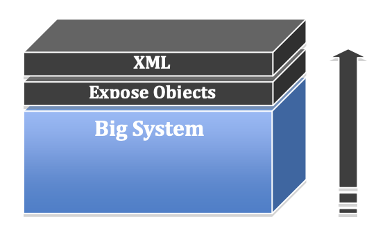
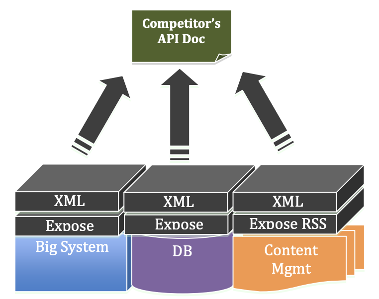
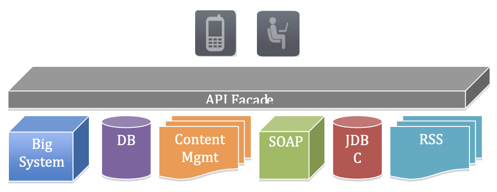
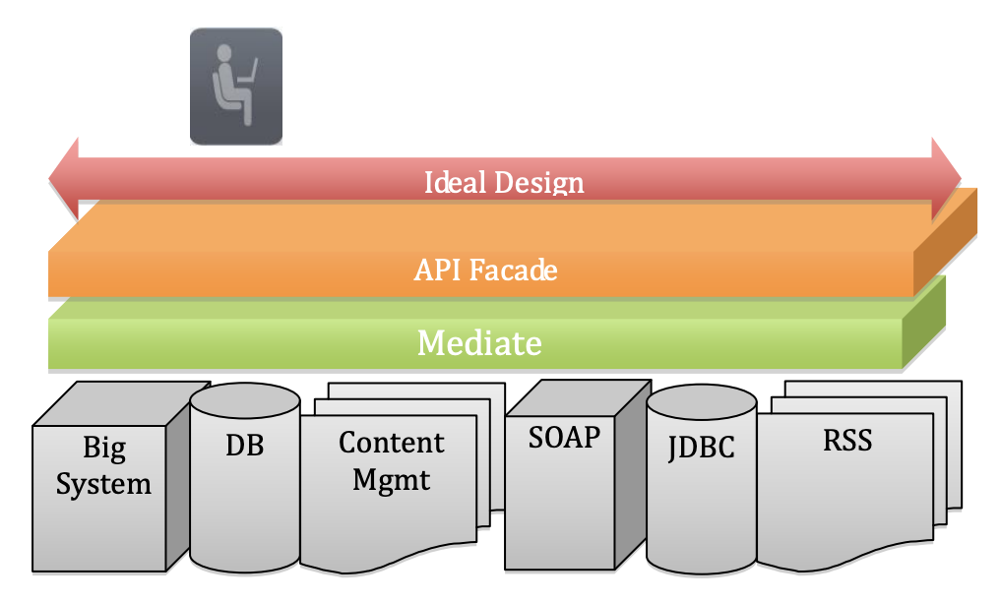

## API Façade 패턴

이 시점에서, 아마도 아키텍처적인 관점에서 어떻게 해야 할지 궁금해할 수 있습니다.

모든 이 가이드라인을 따르면서 내부 서비스와 시스템을 유용하게 노출시키는 동시에 API를 반복 및 유지 관리하는 방법은 무엇일까요?

백엔드 시스템들은 종종 애플리케이션 개발자들에게 직접 노출시키기에는 너무 복잡합니다.
이들은 안정적이고 (시간이 지나면서 검증되었기 때문에) 신뢰성이 있지만, 종종 기존 기술을 기반으로하며 HTTP와 같은 웹 표준에 노출시키기 쉽지 않습니다.
이러한 시스템들은 복잡한 종속성을 가지고 있을 수 있으며, 형식이 변경되는 것에 대응하려면 느리게 변화합니다.

실제로, 문제는 하나의 큰 시스템에 대한 API를 만드는 것이 아니라 API가 개발자들에게 가치있게 사용되기 위해 필요한 여러 보조 시스템에 대한 API를 만드는 것입니다.

우리는 몇 가지 안티 패턴을 살펴볼 필요가 있습니다.
왜 이러한 패턴이 잘 작동하지 않는지 알아봅시다.

### 빌드 업 방식

빌드 업 방식에서 개발자는 대규모 시스템의 핵심 객체를 노출시키고 위에 XML 파싱 레이어를 놓습니다.

이 접근법은 빠르게 버전 1을 출시할 수 있다는 장점이 있습니다.
또한 API 팀 구성원(내부 개발자)들이 시스템의 세부 정보를 이미 이해하고 있기 때문에 이러한 방식이 가능합니다.

하지만, 내부 시스템의 세부 객체 수준의 세부 정보는 외부 개발자에게 혼란을 줄 수 있습니다.
또한 내부 아키텍처의 세부 정보를 노출하는 것은 좋지 않은 방법입니다.
이 방식은 시스템이 작동하는 방식과 API가 노출되는 방식이 1:1 매핑되므로 융통성이 없을 수 있습니다.
즉, 레코드 시스템부터 API로 빌드하는 것은 지나치게 복잡할 수 있습니다.

### 표준 위원회 방식

내부 시스템은 종종 서로 다른 사람들과 부서에서 소유하고 관리하기 때문에 어떻게 작동해야 하는지에 대한 서로 다른 견해가 있을 수 있습니다.
표준 위원회 방식으로 API를 설계하는 것은 종종 스키마 및 URL과 같은 것을 정의하는 표준 문서를 작성하는 것을 포함합니다.
모든 이해 관계자들은 이 공통 목표를 향해 작업을 수행합니다.

이러한 방식의 장점은 버전 1을 빠르게 출시할 수 있다는 것입니다.
또한 조직 전체에서 통합 감각과 포괄적인 전략을 구축할 수 있으므로 대규모 조직에서 이러한 요소를 가지는 것은 상당히 중요한 성과입니다.

그러나 표준 위원회 방식의 단점은 느릴 수 있다는 것입니다.
문서를 빠르게 만들어도, 모든 사람들이 그것에 따라 구현하는 것은 느리게 이루어질 수 있으며 준수가 부족할 수 있습니다.
이러한 접근 방식은 많은 타협으로 인해 보통 그다지 좋은 설계로 이어질 수도 있습니다.

### 흉내쟁이 방식

우리는 종종 이 패턴을 볼 수 있습니다.
이는 조직이 늦게 시장에 진입할 때, 즉 경쟁 업체가 이미 솔루션을 출시한 경우에 발생합니다.
이 접근법은 버전 1로 빠르게 이동할 수 있으며, API를 사용할 앱 개발자가 이미 경쟁 업체의 API에 익숙한 경우 내장된 채택 곡선이 있을 수 있습니다.

그러나, 당신은 단순히 다른 회사의 API 디자인을 복제함으로써 자사의 핵심 가치와 차별화를 드러내지 못하게 될 수 있습니다.
이러한 결과, 당신의 제품은 API 시장에서 열등한 제안으로 여겨질 수 있습니다.

### 해결책 - API Façade 패턴

가장 좋은 해결책은 제품 관리의 기본 원칙을 고려하는 것에서 시작합니다.
제품(즉, API)은 신뢰성, 관련성 및 차별성이 있어야 합니다.
제품 관리자는 API 팀의 주요 구성원 중 하나입니다.

제품 관리자가 큰 그림을 결정한 후에는 아키텍트들이 나서야 합니다.

**API Façade 패턴**을 구현하는 것을 권장합니다.
이 패턴은 인터페이스와 API 구현 사이에 버퍼 또는 가상 레이어를 제공합니다.
즉, Façade를 생성하여 API를 앱 개발자와 최종 사용자의 관점에서 종합적으로 보여줍니다.

API를 사용하는 개발자와 앱은 맨 위에 위치하고, API 구현은 그 밑에 있습니다.
API Façade는 개발자, 앱, 그리고 API를 격리시킵니다.
Façade 패턴을 구현하면 어려운 하나의 문제를 몇 개의 더 간단한 문제로 분해할 수 있습니다.

"하위 시스템에 대한 간단한 인터페이스를 제공하려면 Façade 패턴을 사용하십시오.
하위 시스템은 진화함에 따라 복잡해질 수 있습니다."

[Design Patterns – Elements of Reusable Object-Oriented Software](http://www.yes24.com/Product/Goods/200592) (Erich Gamma, Richard Helm, Ralph Johnson, John Vlissides)

API Façade 패턴 구현에는 기본적으로 세 가지 단계가 필요합니다.

1. 이상적인 API를 디자인합니다.
   URL, 요청 매개변수와 응답, 페이로드, 헤더, 쿼리 매개변수 등을 디자인합니다.
   API 디자인은 자체적으로 일관성이 있어야 합니다.
2. 데이터 스텁을 사용하여 디자인을 구현합니다. 
   이를 통해 애플리케이션 개발자가 내부 시스템에 연결되기 전에도 API를 사용하고 피드백을 제공할 수 있습니다.
3. Façade와 시스템 간의 중재 또는 통합을 수행합니다.

세 단계 접근 방식을 사용하면 하나의 큰 문제를 세 가지 더 작은 문제로 분해할 수 있습니다.
만약 하나의 큰 문제를 해결하려고 하면 코드로 시작하여 비즈니스 로직(기록 시스템)에서 시작하여 깨끗한 API 인터페이스를 구축하려고 할 것입니다.
각 데이터 저장소에서 객체 또는 테이블 또는 RSS 피드를 노출하여 앱에서 사용할 수 있도록 올바른 형식의 XML로 매핑하고 노출합니다.
이는 앱을 중심으로 한 기계 간 지향성이며 이를 올바르게 처리하기 어렵습니다.

이러한 Façade 패턴 접근 방식을 적용하면 몇 가지 중요한 방식으로 분할된 지점 접근 방식(silo approach)에서의 사고를 바꿀 수 있습니다.
먼저, 각각의 세 단계에 대해 구매 협상을 할 수 있으며, 설계에 실용적인 접근 방식을 취하고 있다는 것을 더욱 명확하게 이해할 수 있습니다.
둘째로, 방향이 앱에서 앱 개발자로 변경됩니다.
목표는 설계가 일관성 있고 직관적이기 때문에 앱 개발자가 API를 사용할 수 있도록 보장하는 것입니다.

아키텍처에서 위치한 이유 때문에, Façade는 흥미로운 게이트웨이가 됩니다.
이제 Façade에서 일반적인 패턴(페이지네이션, 쿼리, 정렬, 인증, 권한 부여, 버전 관리 등) 처리를 일관되게 구현할 수 있습니다.
(이는 큰 주제이며, 이 글의 범위를 벗어납니다.)

API 팀에게는 다음과 같은 추가적인 이점이 있습니다.
내부 개발자, 파트너 또는 공개 시나리오와 상관없이 다양한 사용 사례에 보다 쉽게 적응할 수 있습니다.
API 팀은 개발자의 계속 변화하는 요구사항, 프로토콜 및 언어에 대응할 수 있습니다.
기업의 추가 기능을 더하여 API를 확장하거나, 기존 시스템을 추가로 통합할 수도 있습니다.
